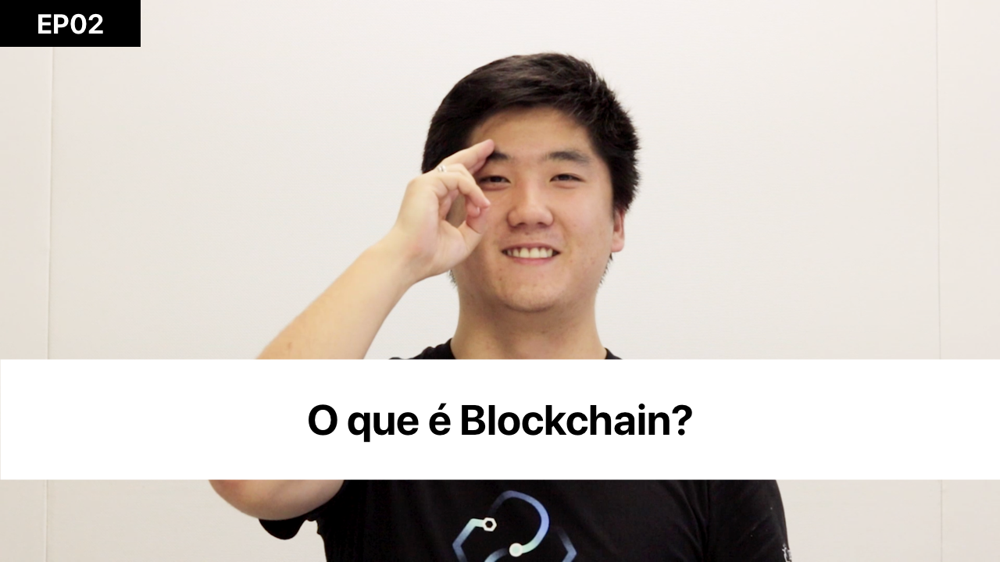
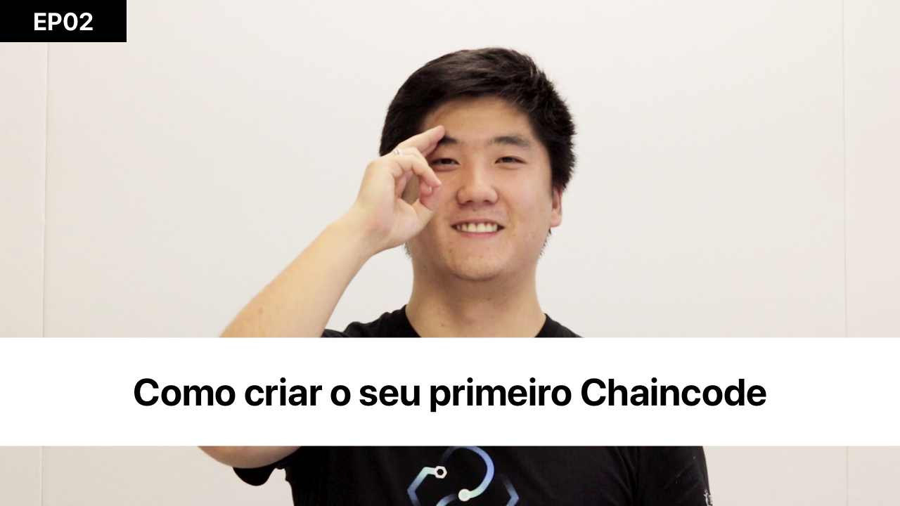
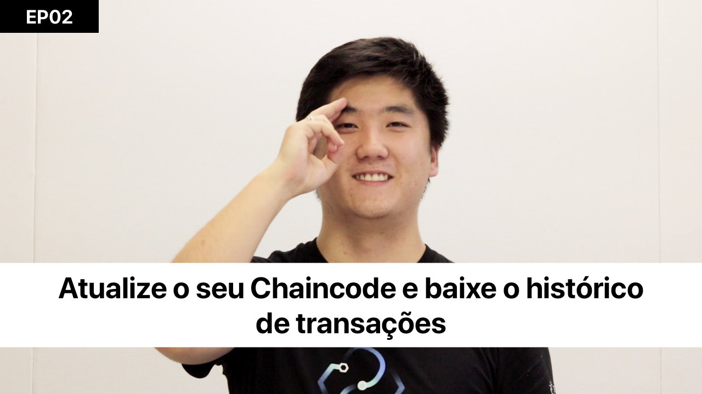
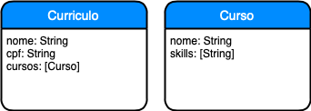
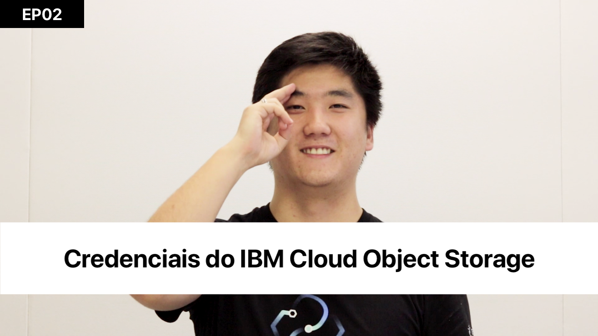
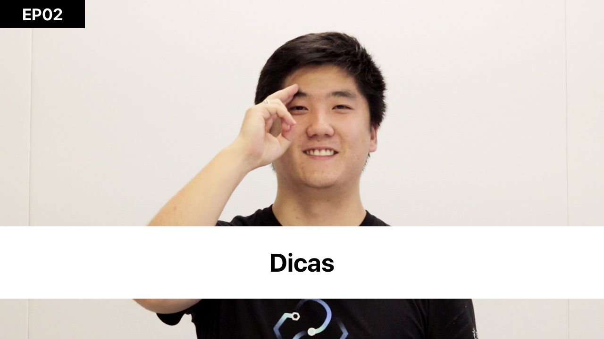

[](https://cloud.ibm.com)
[](https://developer.ibm.com/node/)
[](https://ibm.biz/convite-slack)

# Desafio 08 | LIT (Saint Paul)

* [1. Introdução](#1-introdução)
* [2. Desafio](#2-desafio)
* [3. Pré-requisitos](#3-pré-requisitos)
* [4. Configuração da rede Hyperledger Fabric](#4-configuração-da-rede-hyperledger-fabric)
    * [4.1. Pré-requisitos para configurar o ambiente](#41-pré-requisitos-para-configurar-o-ambiente)
    * [4.2. Como instalar a extensão da IBM Blockchain Platform](#42-como-instalar-a-extensão-da-ibm-blockchain-platform)
* [5. Desenvolvimento do Chaincode (ou Smart Contract)](#5-desenvolvimento-do-chaincode-ou-smart-contract-)
* [6. Avaliação](#6-avaliação)
* [7. Aplicação na nuvem](#7-aplicação-na-nuvem)
    * [7.1. Veja como configurar o IBM Continuous Delivery](#7-1-veja-como-configurar-o-ibm-continuous-delivery)
    * [7.2. Credenciais do IBM Cloud Object Storage](#72-credenciais-do-ibm-cloud-object-storage)
    * [7.3. Configuração do IBM Continuous Delivery](#73-configuração-do-ibm-continuous-delivery)
* [8. Submissão](#8-submissão)
* [9. Dicas](#9-dicas)

## Para te ajudar

* [Material de Apoio](#material-de-apoio)
* [Troubleshooting](#troubleshooting)
* [Dúvidas](#dúvidas)
* [License](#license)

## 1. Introdução

Em época de proliferação de fake news e pós verdades, torna-se cada vez mais necessária a busca constante pela veracidade de informações, especialmente aquelas informações que podem ser decisivas para uma organização, como as informações contidas nos currículos de candidatos em processo de recrutamento e seleção.

Segundo reportagem do jornal Valor Econômico do dia 30 de maio de 2019, “Mais companhias buscam mentiras nos currículos”, cada vez mais vem sendo adotada pelas empresas a prática do “background check” que consiste em verificar se as informações contidas no currículo e no Linkedin de candidatos são realmente verdadeiras.

Entre as informações de currículo que são validadas estão a formação acadêmica dos candidatos, verificando-se dados como instituição de ensino, data de conclusão, validade do certificado, méritos atingidos e notas finais.

Uma aplicação lógica seria utilizar Blockchain para que  dinstituições de ensino pudessem guardar os registros de cursos, avaliações ou habilidades conforme os alunos as obtém. Os alunos poderiam, então, compartilhar com segurança suas informações de currículo, bem como todo histórico de habilidades, garantindo a autenticidade das informações.

<div align="center">
    <a href="https://youtu.be/zHLUaK0DK9c">
        
    </a>
</div>

## 2. Desafio

Diante desta realidade, o LIT, a plataforma digital de aprendizagem de negócios da Saint Paul, oferecendo a seus usuários dezenas de cursos de extensão e trilhas de MBA, quer ajudar as empresas nesta checagem e, também, dar aos seus usuários a vantagem de permitir que seus currículos tenham rastreabilidade e certificação digital. Além disso, o LIT quer também validar os Skills adquiridos pelo usuário em sua jornada de aprendizagem.
 
Para esse desafio, o LIT precisa estar conectado a uma rede de Blockchain que permita gravar a evolução do progresso de seus usuários ao longo da jornada de aprendizagem. 

Um recurso importante que a rede de Blockchain pode oferecer para as empresas é a oportunidade de buscar candidatos através de uma lista de habilidades específicas para uma vaga. A empresa poderia listar quais habilidades precisa para preencher uma posição, e então fazendo um "matching" de skills listados para vaga com os skills comprovados do candidato, a empresa pode ter uma lista de candidatos com currículo certificado e, também, saber quais foram os cursos em que eles desenvolveram estas habilidades e o aproveitamento obtido em cada curso.

Dessa forma, a rede de Blockchain poderá facilitar o acesso das empresas a informações para validar os currículos de candidatos, bem como, para procurar candidatos conforme o perfil necessário para preencher vagas.

## 3. Pré-requisitos

Você deverá cumprir os seguintes itens:

- Registrar na [Maratona Behind the Code](https://ibm.biz/maratona) e confirmar o e-mail de cadastro.
- Registrar na [IBM Cloud](https://ibm.biz/BdzsFc) e confirmar o e-mail de cadastro.

## 4. Configuração da rede Hyperledger Fabric

### 4.1. Pré-requisitos para configurar o ambiente

* Windows 10, Linux, or Mac OS.
* VS Code versão 1.36.0 ou mais recente -> [Download Visual Studio Code](https://code.visualstudio.com/Download).
* Node v8.x  ou mais recente and npm v5.x ou m
* Docker Compose v1.14.0 ou mais recente -> [Download Docker Compose](https://docs.docker.com/compose/install/).

Se você está usando Windows, você deve garantir que os seguintes itens estão instalados:

* `Docker for Windows` se você configurou para usar containers Linux (configuração padrão)
* Ter instaldo o `C++ Build Tools for Windows` do [windows-build-tools](https://github.com/felixrieseberg/windows-build-tools#windows-build-tools)
* Ter instalado o `OpenSSL v1.0.2` do [Win32 OpenSSL](http://slproweb.com/products/Win32OpenSSL.html)
    * Instalar a versão normal, não a versão marcada como `light`.
    * Instalar a versão `Win32` na pasta `C:\OpenSSL-Win32` em sistemas 32-bit.
    * Instalar a versão `Win64` na pasta `C:\OpenSSL-Win64` em sistemas 64-bit.

Caso você decida usar uma VM (Máquina Virtual), acesse o link e baixe o ambiente pré-configurado ~> [VM + IBM Blockchain Platform](https://ibm.box.com/v/vmaratona2019)

### 4.2. Como instalar a extensão da IBM Blockchain Platform

Abra o `Visual Studio Code` (ou VS Code) e acesse o Marketplace de Extensões. Você pode acessar também clicando nas teclas `CMD + SHIFT + X` ou `CTRL + SHIFT + X` (se for Windows).

<div align="center">
    
</div>

Busque por `IBM Blockchain Platform` na busca do Marketplace. Clique sobre o primeiro item (`IBM Blockchain Platform 1.0.5`) e procure por um botão `verde` de `install` para instalar a extensão.

<div align="center">
    
</div>

Após a instalação, é necessário que você reinicie o seu VS Code para finalizar a instalação.

No VS Code vai aparecer um botão, no canto esquerdo, com o logo da IBM Blockchain Platform. Se você conseguiu chegar aqui, então você configurou corretamente a extensão.

<div align="center">
    
</div>

## 5. Desenvolvimento do Chaincode (ou Smart Contract)

Veja o vídeo abaixo de como criar a sua primeira rede e seu primeiro chaincode, usando a extensão do IBM Blockchain Platform no VS Code.

<div align="center">
    <a href="https://youtu.be/0YAejGOECZA">
        
    </a>
    <a href="https://youtu.be/i5DI5lsYvlU">
        
    </a>
</div>

Link do asset criado no vídeo: https://github.com/victorshinya/university-chaincode

## 6. Avaliação

Os participantes deverão criar uma rede de Blockchain local, usando a extensão do `VS Code` da `IBM Blockchain Platform` (veja o [vídeo acima](#5-desenvolvimento-do-chaincode-ou-smart-contract-)), e configurá-la com um chaincode para cadastrar um asset: `curriculum`. Dentro dele, deve ser possível inserir `course` e `skills` (igual o diagrama abaixo). Veja na imagem abaixo a estrutura que deve ser adotada, lembrando que a extensão **gera cinco funções** para gerenciar um Asset (resumidamente, um `CRUD`).

<div align="center">
    
</div>

**Use `name`, `cpf` e `courses` como itens no `curriculum` e `name` e `skills` como itens no `course`**

Você deve criar duas funções com o nome de `createCourse` e `readCurriculumHistory`, para cadastrar um novo curso realizado (e suas `skills`) e gerar o histórico das transações dentro da rede de Blockchain, respectivamente. Para a segunda função, você deve importar no seu projeto o código [`aux.js`](doc/source/chaincode/aux.js). A função deve buscar todo o histórico de transações dentro da rede pelo CPF informado. A função `readCurriculumHistory` irá exportar um arquivo `history.json` com o resultado da busca do auxiliar.

Baixe a classe Aux: [aux.js](doc/source/chaincode/aux.js).

Lembre-se: **A geração do arquivo `.json` só acontecerá após a execução da função descrita acima e a execução do comando abaixo na sua linha de comando**

```sh
docker cp {id do container}:/usr/local/src/history.json history.json
```

Para buscar o `id` do container, você pode executar esse comando em um terminal. Ele irá listar todos containers fazendo um filtro pela imagem do container com a estrutura gerada da extensão do IBM Blockchain Platform. Pegue o `id` do primeiro item da lista (ela está ordenada de forma crescente, ou seja, do mais recente para o mais antigo).

```sh
docker ps | grep "fabricvscodelocalfabric-peer0.org1.example.com"
```

## 7. Aplicação na nuvem

Para subir a aplicação na IBM Cloud, você deve `clicar no botão` abaixo para subir usando o IBM Continuous Delivery (também conhecido como Delivery Pipeline). **Você deve subir a sua aplicação em Dallas**.

🚨 **CLIQUE PARA SUBIR A APLICAÇÃO NA IBM CLOUD** 🚨

[](https://cloud.ibm.com/devops/setup/deploy?repository=https://github.com/maratonadev/desafio-8)

### 7.1. Veja como configurar o IBM Continuous Delivery

1. Configure o `Toolchain Name` com `<maratona-id>-desafio8-behindthecode`, substituindo o `<maratona-id>` pelo seu ID da Maratona (Ex: 100001). Se você não souber, verifique no seu e-mail, usado no registro da Maratona, para pegar o seu ID.

2. Configure o `App name` com a mesmo valor usado no item 1.

3. Crie uma chave (de uso interno). Basta clicar em "Create" e depois clique em "Create" novamente. Espere um instante até carregar todas os dados. Se demorar muito (mais de 5 minutos), recarregue a página e faça novamente o passo 1 e 2. **Na parte superior, você pode deixar em Washington DC ou Dallas. Já na parte inferior (abaixo do item 2), é mandatório configurar a Região de Dallas**.

<div align="center">
    
</div>

### 7.2. Credenciais do IBM Cloud Object Storage

Veja no vídeo abaixo como localizar as credenciais do `ICOS` ou `IBM Cloud Object Storage` para a submissão. Se tiver dúvida sobre o processo, veja na seção [Submissão](#8-submissão). Você deve copiar as credenciais para configurar o `.env` no passo abaixo. Lembre-se: **Configure o Bucket do ICOS e suba o arquivo `.zip` quantas vezes quiser. Ele deve ser nomeado com o seu ID + o formato `.zip` (Ex: ID da Maratona = 100001 => `100001.zip`).**

<div align="center">
    <a href="https://youtu.be/97YEEjU6nG4">
        
    </a>
</div>

### 7.3. Configuração do IBM Continuous Delivery

Clique em `Eclipse Orion Web IDE` para configurar a aplicação.

<div align="center">
    
</div>

Abaixo está o passo-a-passo, **obrigatório**, para configurar a sua aplicação no Eclipse Orion Web IDE.

1. Abra o arquivo `.env` para colocar as credenciais da `Maratona` (lembre-se de que é o mesmo código usado para indicar novos participantes na Maratona). Preencha com os dados, após o `=` (símbolo de igual).

```
# Credenciais para o Desafio 8
DESAFIO=8
MARATONA_ID=

# IBM Cloud Object Storage
BUCKET=
IAM_SERVICEID_CRN=
APIKEY=
```

<div align="center">
    
</div>

2. Abra o arquivo `manifest.yml` e altere o `<maratona-id>` com o seu ID da Maratona, o mesmo usado acima. Lembre-se: é mandatório ter a URL com o formato do `name`, apresentado abaixo.

```
applications:
- name: <seu-id>-desafio8-behindthecode
  memory: 256M
  instances: 1
  buildpack: sdk-for-nodejs
```

<div align="center">
    
</div>

Clique em `Create new launch configuration` e crie a configuração para a sua aplicação (que está sendo criada em *background*). `Launch Config Name`, `Application Name` e `Host` devem ter o mesmo nome, com o formato `<maratona-id>-desafio8-behindthecode`, igual nos itens anteriores. Clique em `SAVE` para salvar as configurações.

<div align="center">
    
    
</div>

Clique em `PLAY` (primeiro botão na imagem). Espere até ficar `verde` (com o status: `running`). Depois, clique em `Open` (terceiro botão na imagem). Vai abrir a sua aplicação, com as configurações implementadas.

<div align="center">
    
    
</div>

## 8. Submissão

🚨 **TESTE BASTANTE O SEU CHAINCODE E FAÇA DIVERSAS TRANSAÇÕES** 🚨

Crie várias transações, de currículo e curso, para gerar um histórico. Faça quantos testes forem necessários e, se precisar, crie e re-crie a rede e o chaincode para melhorar cada vez mais. Quando se sentir confortável, faça a submissão do seu desafio. Lembre-se: **NÃO é possível submeter mais de uma vez**. Fique atento!

Gere um arquivo `.zip` com o `CHAINCODE` e o `HISTORY.JSON`, com o nome `<seu-id>.zip`, e suba no `IBM Cloud Object Storage`.

Através da aplicação na IBM Cloud (`https://<seu-id>-desafio8-behindthecode.mybluemix.net`), você irá clicar no botão **SUBMETER DESAFIO**, preencher com o seu CPF e enviar para a avaliação final.

FIQUEM LIGADOS NO [SITE DA MARATONA](ibm.biz/maratona) PARA ACOMPANHAR O RANKING GERAL E O RANKING DO DESAFIO! FIQUE NA TORCIDA PARA ESTAR ENTRE OS MELHORES!

## 9. Dicas

No vídeo abaixo vocês já terão acesso a dicas do Desafio 8.

<div align="center">
    <a href="https://youtu.be/4eUpnhw4ZXM">
        
    </a>
</div>

## Material de apoio

- [O que é a IBM Cloud e como subir a sua primeira aplicação na nuvem](https://medium.com/ibmdeveloperbr/o-que-%C3%A9-a-ibm-cloud-e-como-subir-a-sua-primeira-aplica%C3%A7%C3%A3o-na-nuvem-41bfd260a2b7?source=friends_link&sk=7944d2fe14aa940e9bade68ce0731ba0)
- [Desenvolvendo contratos inteligentes com a extensão do Visual Studio Codes](https://cloud.ibm.com/docs/services/blockchain?topic=blockchain-develop-vscode&locale=pt-br)

## Troubleshooting

1. No `Logs` da aplicação, apresentou um erro (em vermelho). O que pode ser? 

    Resposta: **Veja se você colocou as credenciais da Maratona, Watson Assistant e Machine Learning no arquivo `.env` e se o arquivo `manifest.yml` está correto, conforme [descrito acima](#credenciais-na-aplicação). Veja se a sua aplicação está rodando na URL correta conforme [descrito acima](#submissão).**

    <br>

2. Gerou transações erradas e deseja reiniciar o histórico?

    Resposta: **Acesse a extensão do `IBM Blockchain Platform` e na aba `LOCAL FABRIC OPS`, clique no menu e clique em `Teardown Fabric Runtime`. Clique novamente no `Local Fabric runtime is stopped.[...]`. Ele irá subir uma nova rede local com o histórico zerado.**

## Dúvidas

Acesse o slack e mande a sua dúvida: [ibm.biz/convite-slack](https://ibm.biz/convite-slack).

## License

Copyright 2019 Maratona Behind the Code

   Licensed under the Apache License, Version 2.0 (the "License");
   you may not use this file except in compliance with the License.
   You may obtain a copy of the License at

       http://www.apache.org/licenses/LICENSE-2.0

   Unless required by applicable law or agreed to in writing, software
   distributed under the License is distributed on an "AS IS" BASIS,
   WITHOUT WARRANTIES OR CONDITIONS OF ANY KIND, either express or implied.
   See the License for the specific language governing permissions and
   limitations under the License.
